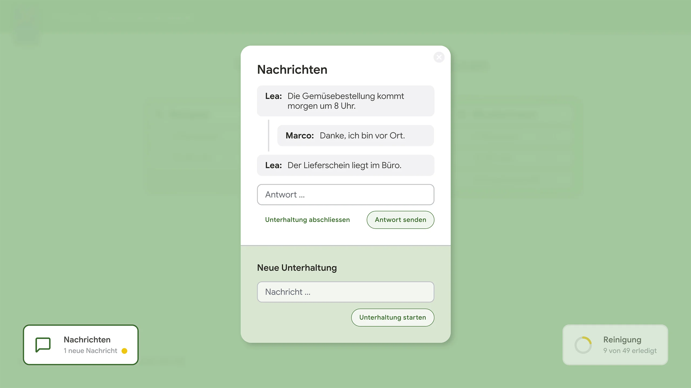

# UD Plugin: Notes

UD Notes ergänzt eine betriebliche WordPress-Frontend-Anwendung um live synchronisierte Kurznachrichten. Angemeldete Benutzerinnen und Benutzer können Mitteilungen erfassen, darauf antworten und abgeschlossene Unterhaltungen aus der Liste der offenen Nachrichten nehmen.

Das Modul ist als eigenständiger Arbeitsbereich in die gemeinsame Frontend-Navigation eingebunden. Eine Statusanzeige macht neue Nachrichten sichtbar und öffnet den zugehörigen Nachrichtenbereich.

## Funktionen

- Neue Unterhaltung im Frontend erfassen
- Antworten einer bestehenden Unterhaltung zuordnen
- Abgeschlossene Unterhaltungen als erledigt markieren
- Offene Unterhaltungen über geschützte REST-Endpunkte laden und bearbeiten
- Neue Nachrichten und Antworten über Ably synchronisieren
- Status für neue Nachrichten in der gemeinsamen Frontend-Navigation anzeigen
- Gelesen-Zustand lokal im verwendeten Browser verwalten

## Frontend-Ansichten



Eine Nachricht bildet den Ausgangspunkt einer Unterhaltung. Antworten bleiben diesem Verlauf zugeordnet. Nach Abschluss der Absprache wird die Unterhaltung als erledigt markiert und aus der Liste der offenen Nachrichten genommen.
Eine neue Absprache beginnt als eigener Verlauf. Die Navigation zeigt zugleich, ob neue Nachrichten vorhanden sind, und führt direkt zum Nachrichtenbereich.

## Daten und Schnittstellen

Das Plugin verwaltet Nachrichten in einer eigenen WordPress-Datenbanktabelle. Gespeichert werden:

- Nachricht
- Autor
- Erstellungszeitpunkt
- Zuordnung einer Antwort zur übergeordneten Nachricht
- Erledigt-Status

Geschützte REST-Endpunkte übernehmen das Erstellen, Beantworten, Abrufen und Abschliessen der Einträge. Der Zugriff ist auf angemeldete Benutzerinnen und Benutzer mit Leseberechtigung beschränkt.

## Einordnung in die Anwendung

UD Notes und [UD Reinigung](https://github.com/ulrich-digital/ud-reinigung) sind eigenständige Module derselben betrieblichen Frontend-Anwendung. Sie verwenden gemeinsame Interaktionsmuster wie Button-Bar, Statusanzeige und Modalfenster, tauschen untereinander jedoch keine Daten aus.

UD Notes erwartet die vorhandene UD-Frontend-Navigation mit dem Element `#ud-button-bar`. Die Ably-Konfiguration stammt aus der Infrastruktur der zugehörigen Anwendung und wird in einer geplanten Update-Runde technisch überarbeitet.

## Installation

1. Den Plugin-Ordner `ud-notes` nach `wp-content/plugins/` kopieren.
2. Die benötigte Frontend-Anwendung und deren Echtzeit-Infrastruktur bereitstellen.
3. UD Notes im WordPress-Backend aktivieren.
4. Der Nachrichtenbereich wird für angemeldete Benutzerinnen und Benutzer in die vorhandene Button-Bar eingefügt.

## Entwicklung

```bash
npm install
npm run start
```

Produktions-Build erstellen:

```bash
npm run build
```

## Autor

[ulrich.digital gmbh](https://ulrich.digital)

## Lizenz

Alle Rechte vorbehalten. Dieses Plugin ist urheberrechtlich geschützt und darf ohne ausdrückliche schriftliche Genehmigung der **ulrich.digital gmbh** weder kopiert, verbreitet, verändert noch weiterverwendet werden.
