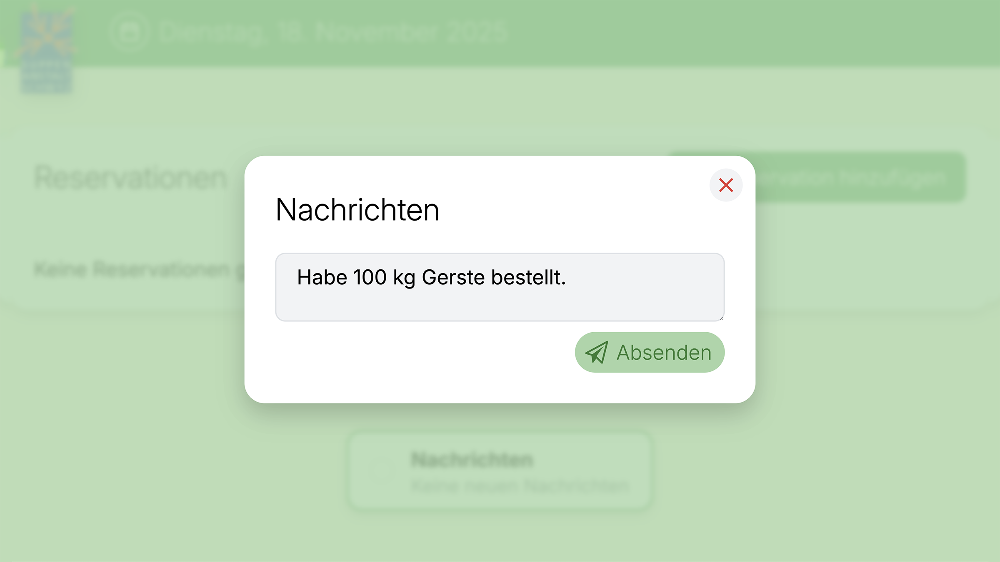
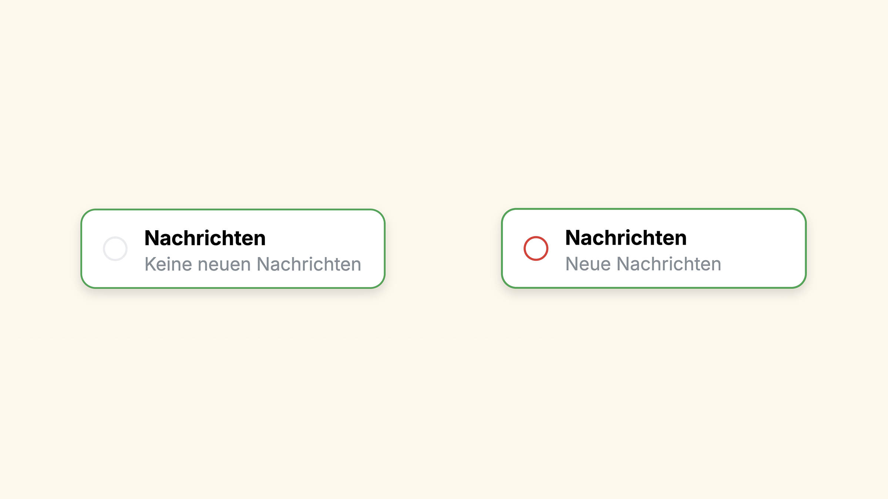

# UD Plugin: Notes

UD Notes ermöglicht live synchronisierte Nachrichten im Frontend. Alle Nachrichten werden in Echtzeit aktualisiert, inklusive Antworten und Erledigt-Markierungen. Das System eignet sich ideal für Arbeitsabläufe in der Suppenanstalt, bei denen mehrere Personen gleichzeitig kurze Statusmeldungen austauschen.

## Funktionen

- Nachrichten im Frontend erstellen
- Antworten auf bestehende Nachrichten
- Erledigt-Markierungen für abgeschlossene Punkte
- Live-Synchronisation über Ably
- Sichtbarer Status in der Button-Bar (Neue Nachrichten / Keine neuen Nachrichten)
- Lokale Gelesen-Logik pro Benutzer
- Integration in bestehende UD-Frontend-Navigation

## Screenshots

*Ansicht zum Erstellen einer neuen Nachricht im Frontend. Nachrichten werden direkt nach dem Absenden synchronisiert und für alle Benutzer sichtbar.*

*Der vollständige Nachrichtenverlauf mit Antworten und Erledigt-Funktion. Nachrichten werden in Echtzeit aktualisiert und nach Autor getrennt dargestellt.*

*Statusanzeige in der Button-Bar: links ohne neue Nachrichten, rechts mit ungelesenen Nachrichten. Der Hinweis aktualisiert sich automatisch in Echtzeit.*

## Voraussetzungen

Dieses Plugin benötigt das Plugin **UD Reservation**, um zu funktionieren.  
Ohne UD Reservation werden weder der Block noch REST-Endpunkte oder Scripts geladen.

## Installation

1. Plugin herunterladen und in WordPress installieren  
2. UD Reservation aktivieren  
3. UD Notes aktivieren  
4. Im Frontend erscheint der Nachrichten-Button automatisch in der UD-Button-Bar

## Echtzeit-Technik

UD Notes verwendet die Ably Realtime API.  
Der API-Key wird automatisch von UD Reservation übernommen, sodass keine zusätzliche Konfiguration notwendig ist.

## Autor

[ulrich.digital gmbh](https://ulrich.digital)

## Lizenz

Alle Rechte vorbehalten.
Dieses Plugin ist urheberrechtlich geschützt und darf ohne ausdrückliche schriftliche Genehmigung der **ulrich.digital gmbh** weder kopiert, verbreitet, verändert noch weiterverwendet werden.

